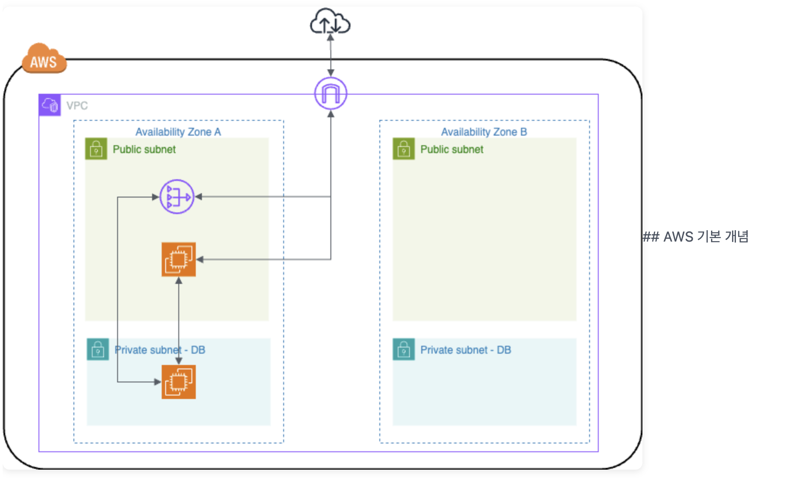

# AWS 기본 구성



- VPC
    - 클라우드 내부에 논리적으로 격리된 가상의 독립적인 네트워크 공간
- Internet Gateway
    
    
    
    - VPC 내부의 자원들이 외부 인터넷과 통신할 수 있게 연결해 주는 출입구 역할
    - 격리된 VPC와 인터넷을 연결해주는 중간 매개체 역할
        - 아래와 같은 순서로 서브넷에 인터넷을 연결
        1. 인터넷 게이트웨이를 생성
            - VPC와 외부 인터넷 간의 트래픽을 연결해 주는 논리적인 라우터 컴포넌트
        2. 라우트 테이블에 인테넷 게이트웨이를 연결
            - 서브넷 안에서 발생한 트래픽이 목적지로 가기 위해 어떤 경로를 타야 하는지 정의해 둔 네트워크 규칙
            - 트래픽의 목적지(Destination)가 내부 망이 아닌 모든 외부 인터넷(`0.0.0.0/0`)일 경우, 그 트래픽을 방금 만든 인터넷 게이트웨이(Target)로 내보내도록 경로를 추가하는 설정
        3. VPC 내 리소스에 공인 IP가 필요
            - 외부 인터넷 환경에서 해당 인스턴스(EC2)를 유일하게 식별하고 도달할 수 있게 해주는 공인 IP 주소
            - 인스턴스가 인터넷과 통신하려면 퍼블릭 IP를 가지고 있어야 하며, 인터넷 게이트웨이(IGW)가 트래픽이 나갈 때 이 프라이빗 IP를 퍼블릭 IP로 1:1 주소 변환(NAT)을 수행해서 통신을 가능
- Availability Zone
    - 물리적으로 분리된 데이터 센터
- Public Subnet
    - 인터넷 게이트웨이와 연결되어 있어 외부 인터넷과 직접 통신할 수 있는 개방된 구역
- Private Subnet - DB (프라이빗 서브넷)
    - 외부 인터넷에서 직접 접근할 수 없도록 차단된 안전한 구역
- **NAT Gateway**
    
    
    
    - Private 서브넷은 인터넷 연결시켜줌
        1. NAT 게이트웨이를 Public 서브넷 내 생성
        2. 라우트 테이블에 NAT 게이트웨이를 연결
    - Private 서브넷의 인스턴스들이 인터넷으로 아웃바운드 트래픽을 보낼 수 있게 하며, 반대로 인바운드 인터넷 트래픽으로부터 Private 서브넷의 인스턴스들에 직접 접근하지 못하게 보호하는 역할
- EC2
    
    
    
    - 퍼블릭 서브넷의 EC2
        - 주로 웹 서버나 WAS(웹 애플리케이션 서버) 역할을 해. 외부 통신이 가능하며, 사용자 요청을 직접 처리
    - 프라이빗 서브넷의 EC2
        - 데이터베이스(DB) 역할
        - 외부에서는 절대 직접 들어올 수 없고, 화살표가 보여주듯 오직 퍼블릭 서브넷에 있는 EC2(웹 서버)를 통해서만 데이터를 주고받을 수 있음

### AWS 네트워크

- AWS 네트워크
    - 리전(Region) > VPC > AZ(가용 영역) > 서브넷(Subnet)
        - **리전 (Region)**
            
            
            
            - 고정된 값
            - '대한민국 서울'이나 '미국 버지니아' 같은 커다란 지역
            - 현재 한국에는 하나의 리전, 서울 리전(ap-northeast-2)이 존재하고 가용영역은 4개가 존재
            - 각 리전은 독립적이고 물리적으로 분리된 3개 이상의 가용 영역으로 구성
        - **VPC**
            
            
            
            - 서울 땅 한가운데에 높은 울타리를 치고 우리만 쓰기로 한 거대한 사유지 또는 본사 캠퍼스 부지
            - 서울 리전이라는 넓은 땅 안에, 방탈출 서비스 전용의 독립된 가상 네트워크
            - AWS에 사용자가 구성하는 가상 네트워크
                - 기본적으로 리전당 최대 5개의 VPC를 구성
                - VPC는 하나의 사설 IP 대역을 보유하고, 이를 Subnet 단위로 다시 쪼개서 사용
                    - VPC 생성 시 IPv4 주소 범위(프라이빗 IPv4 주소 범위)를 CIDR(Classless Inter-Domain Routing) 블록 형태로 지정
            - AWS 클라우드에서 다른 고객과 완벽하게 논리적으로 격리된 네트워크 공간을 제공
        - **가용 영역 (AZ)**
            
            
            
            
            
            - AWS 리전에서 독립적이고 중복된 전원 인프라, 네트워킹 및 연결을 갖춘 하나 이상의 데이터 센터
            - 내결함성을 갖도록 설계
                - 재해에 대비하기 위해 다른 가용영역과 지리적으로 떨어진 곳에 위치
                - 각 가용영역은 프라이빗 링크를 통해 다른 가용영역과 연결
            - 특정 가용영역의 위치를 사용자는 알수 없으며, 하나의 가용영역에 쏠림을 방지하기 위해 같은 가용영역 `AZ a`라고 해도 실제 위치는 사용자별로 달라질 수 있습니다.
            - `ap-northeast-2a`
            - `ap-northeast-2b`
            - `ap-northeast-2c`
            - `ap-northeast-2d`
                - 만약 하나의 AZ가 마비된 경우 로드 밸런서가 이를 파악하고 다른 AZ 로 이동시킴
                - AZ 간에는 최대 100km 이내의 거리를 두고 있음
        - **서브넷 ( Subnet )**
            
            
            
            - AZ 안에 각각 퍼블릭과 프라이빗 서브넷을 만들고 자원을 배치
                - public subnet
                    - 인터넷 게이트웨이를 통해 public internet과 통신
                - private subnet
                    - 외부와 차단되어 있음
                    - 인터넷 inbound/outbound가 불가능
                    - 다른 서브넷과의 연결만 가능
                    - public internet과 통신하기 위해서 NAT 장치가 필요
            - VPC가 가지는 사설 IP 대역의 일부분을 논리적으로 분할한 영역
                - 하나의 서브넷(Subnet)은 반드시 하나의 AZ에 위치
                - 서브넷 생성시 다음의 세가지를 반드시 설정
                    - 서브넷을 생성할 대상 VPC
                    - 서브넷을 생성할 가용영역 AZ
                    - 대상 VPC의 IP 대역 내의 **서브넷 CIDR block**
            - 서브넷은 반드시 하나의 라우트 테이블에 연결
                - 하나의 라우트 테이블을 여러 서브넷이 함께 사용하는 것은 가능
                - CIDR `10.0.0.0/16`를 가지는 VPC를 대상으로 라우트 테이블을 생성하면, 기본적으로 VPC IP 범위에 해당하는 범위를 기본 라우팅 경로로 가지며 이를 `local`로 표기

### **CIDR**


- 네트워크의 주소와 크기를 표현하는 방식 중 하나
    - 16 → 16개 비트는 고정
    
    ```jsx
    [IP 주소]/[Prefix 길이]
    
    10.0.0.0/16
    ```
    
    - 뒤의 16비트는 자유롭게 가능
        - 가변 범위인 뒤의 두 칸(16비트)을 마음대로 쓸 수 있으니까, 우리가 이 VPC 안에서 만들 수 있는 IP 주소의 개수는 2^16개, 즉 65,536개
        - `10.0.0.0/16`으로 VPC를 만들었다는 건 "내 사유지 주소는 무조건 10.0. 으로 시작할 거고, 그 뒤에 남는 자리들로 약 6만 5천 개의 서버나 DB(건물들)를 세울 수 있는 아주 넓은 땅을 샀다
        - 6만 5천 개의 IP를 다시 쪼개서 "퍼블릭 서브넷은 `10.0.1.0/24` (256개) 주고, 프라이빗 서브넷은 `10.0.2.0/24` (256개) 줘야지~" 하는 식으로 배분
- 가상 네트워크
- IP는 한정 자원


- 서브넷(Subnet) 쪼개기
    - 커다란 VPC 망을 가용 영역(AZ)별로, 그리고 용도별로 잘게 쪼개는 작업
    - VPC가 가진 전체 IP 주소 범위 안에서, 퍼블릭 서브넷과 프라이빗 서브넷이 쓸 'IP 주소의 부분 집합(Subnet)'을 할당


- VPC는 기본적으로 고립된 망이라 외부와 통신할 수 없는데, 이 **인터넷 게이트웨이를 VPC에 달아주면서 외부 인터넷과 통신할 수 있는 출입구**
    - 왼쪽에 `172.16.x.x` 라고 적힌 건 퍼블릭 서브넷에 할당된 구체적인 IP 대역


- 퍼블릭 서브넷 안에 주황색 EC2(서버)
    - 이 서버는 외부 인터넷망과 직접 데이터를 주고받을 수 있는 상태


- 프라이빗 서브넷을 만들고, 그 안에도 EC2(주로 DB 서버)
    - 프라이빗 서브넷의 EC2에서 뻗어나간 화살표를 보면 인터넷 게이트웨이로 가지 않고, 오직 퍼블릭 서브넷의 EC2와만 연결되어 있음. 외부망과는 철저히 단절된 채 내부 통신만 하는 안전한 상태


- **프라이빗 망에 있는 DB 서버도 보안 패치나 업데이트를 다운로드하려면 아주 가끔 인터넷에 접속해야 할 일이 생김. 하지만 인터넷 게이트웨이와 직접 연결하면 보안이 뚫리게 됨**
    - **퍼블릭 서브넷에 보라색 아이콘(NAT 게이트웨이)을 하나 추가**
    - **프라이빗 서버는 바깥으로 나가고 싶을 때 직접 나가지 않고 이 NAT 게이트웨이로 요청**
    - **NAT 게이트웨이가 대신 인터넷 게이트웨이로 나가서 데이터를 받아온 다음 프라이빗 서버로 전달해 주는 구조**

