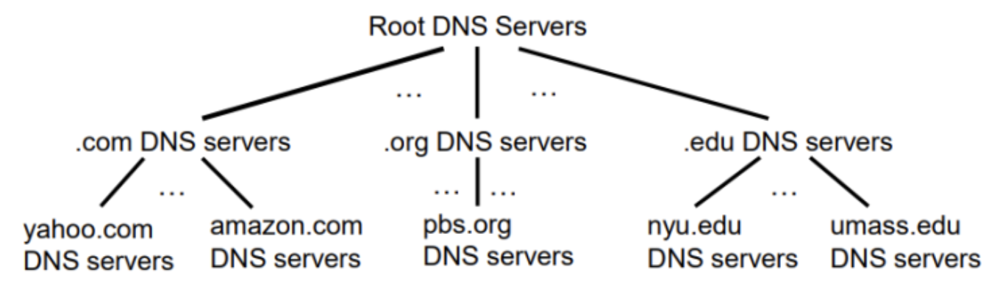

# DNS ( Domain Name System )

- 사람처럼 인터넷도 이름을 쓴다!
    - 사람: SSN, 이름, 여권 번호 등 다양한 식별자 사용
    - 인터넷 호스트:
        - IP 주소: 실제 통신에 사용 (32비트, IPv4 기준)
        - 도메인 이름: 사람이 기억하기 쉬운 형식 ([cs.umass.edu](http://cs.umass.edu/) 등)
    - 도메인 이름 ↔ IP 주소 사이의 매칭이 필요함
        - → 이 매핑을 수행하는 시스템이 DNS

### **DNS 정의**

- 분산형 데이터베이스
    - → 전 세계 수많은 name server 들이 계층적으로 나눠 관리
- 애플리케이션 계층 프로토콜
    - 호스트와 DNS 서버가 통신하며 이름을 해석
    - 핵심 인터넷 기능이면서도 응용 계층에서 작동함
- **DNS가 제공하는 서비스**
    - 호스트 이름 ↔ IP 주소 변환
    - 호스트 별칭
        - [www.google.com](http://www.google.com/) → [server23.google.com](http://server23.google.com/)
    - 메일 서버 별칭
    - 부하 분산
        - 하나의 도메인 이름에 여러 IP 주소가 할당될 수 있음 → 트래픽 분산에 유리
- 왜 DNS를 중앙집중화하지 않을까?
    - 단일 장애 지점
        - → 전체 시스템이 멈출 수 있음
    - 트래픽 과부하
        - → 전 세계 요청이 한 서버로 몰림
    - 거리 문제
        - → 응답 시간 증가
    - 유지보수 어려움
        - → 업데이트 반영 지연 등 문제

### **DNS는 분산되고 계층적인 데이터베이스**



- **DNS 계층 구조**
    - Root DNS Servers
        - 최상위 루트 서버
        - 모든 Top-Level Domain 서버 정보를 알고 있음
    - Top Level Domain Servers
        - .com, .org, .edu 등
        - 각 도메인의 세부 DNS 서버 위치를 알려줌
        - .com TLD 서버는 amazon.com DNS 서버 위치를 알려줌
    - Authoritative DNS Servers
        - 해당 도메인의 실제 IP 정보를 저장
- **도메인 네임 쿼리 예시**
    - Client가 www.amazon.com의 IP를 알고 싶을 때
        - **루트 서버에 질의** → .com DNS 서버 주소 획득
        - **.com DNS 서버에 질의** → amazon.com DNS 서버 주소 획득
        - **amazon.com DNS 서버에 질의** → www.amazon.com의 IP 획득
        - 점진적으로 아래로 내려가며 최종 IP를 얻는 방식 → **계층적 이름 해석**

### **root name servers**


- **특징**
    - 13개의 논리적 루트 서버 존재
    - 하지만 실제로는 전 세계에 수백 개로 복제되어 있음
        - 미국 내에만 약 200개 이상 있음
- **역할**
    - 하위 서버의 위치를 알려줌
- **중요성**
    - 인터넷 작동의 핵심 기능
    - 없으면 이름을 IP로 바꾸는 DNS 자체가 작동 불가
    - ICANN이 루트 DNS 도메인을 관리
    - DNSSEC을 통해 보안 기능 제공

### Top-Level Domain


- .com, .org, .net, .edu 등 **최상위 도메인**을 관리하는 서버
- 또한 국가별 도메인도 포함
- 예시
    - .com, .net → Network Solutions
    - .edu → Educause
- 루트 서버로부터 질의를 받아서, 도메인에 해당하는 권한 있는 DNS 서버 주소를 알려줌

### Authoritative DNS Servers


- 조직이나 기업이 자체적으로 운영하거나 외부 서비스 업체가 운영하는 서버
- 실제 도메인 이름에 대응하는 IP 주소 정보를 가지고 있음
    - www.amazon.com → 205.251.242.103

### **Local DNS Name Servers**

- **로컬 DNS 서버란?**
    - 사용자의 컴퓨터나 라우터에서 가장 가까운 DNS 서버
    - 일반적으로 ISP가 제공
- **역할**
    - 로컬 캐시에서 IP 주소를 빠르게 찾아줌
        - (단점: 오래되었을 수 있음)
    - DNS 계층 구조에 따라 질의를 포워딩함
- **주의**
    - 로컬 DNS는 DNS 계층 구조의 일부는 아님
        - → 클라이언트의 쿼리를 받아 중계 또는 직접 응답하는 역할
- 전체 흐름 요약
    - 클라이언트가 www.amazon.com 입력
    - **로컬 DNS 서버가 먼저 응답 시도 (캐시 또는 계층 포워딩)**
        - 로컬 DNS 서버에 없다면 루트 서버 → TLD 서버 → authoritative 서버 순으로 질의 이동
    - IP 주소 응답 → 클라이언트에게 전달

```sql
gahyeonnni@gahyeonnniui-MacBookAir ~ % scutil --dns
DNS configuration

resolver #1
  nameserver[0] : 20.249.183.121
  nameserver[1] : 168.126.63.1
  if_index : 12 (en0)
  flags    : Request A records
  reach    : 0x00000002 (Reachable)
```

### **Iterated Query**


- **engineering.nyu.edu 호스트가 gaia.cs.umass.edu의 IP 주소를 원함**
    - **질의 흐름**
        - 클라이언트 → Local DNS (dns.nyu.edu)
        - Local DNS → Root DNS → .edu TLD DNS 주소 받음
        - Local DNS → .edu TLD DNS → umass.edu DNS 주소 받음
        - Local DNS → umass.edu DNS → gaia.cs.umass.edu IP 받음
        - Local DNS → 클라이언트에게 IP 전달
    - **장점**
        - 상위 DNS 서버에 부담이 적음
        - 각 단계가 단순히 다른 서버를 알려주는 역할만 함

### **Recursive Query**


- 동일하게 [engineering.nyu.edu](http://engineering.nyu.edu/) 호스트가 [gaia.cs.umass.edu](http://gaia.cs.umass.edu/) IP 주소 요청
    - **질의 흐름**
        - 클라이언트 → Local DNS (dns.nyu.edu)
        - Local DNS → Root DNS
        - Root DNS → .edu TLD DNS
        - .edu TLD DNS → umass.edu DNS
        - umass.edu DNS → gaia.cs.umass.edu IP 반환
        - Root → Local DNS
        - Local DNS → 클라이언트에게 IP 전달
    - **단점**
        - 상위 DNS 서버들에 부하 집중
        - 계층적 DNS 서버들이 직접 다음 단계를 모두 처리해야 함

### **Caching DNS Information**

- 캐싱이란?
    - 어떤 DNS 서버가 도메인 이름과 IP 주소 간의 매핑을 알게 되면, 이를 캐시에 저장
    - 이후 동일한 요청에 대해 빠르게 응답 가능
- **캐싱의 장점**
    - 응답 속도 향상
    - 루트/상위 서버로의 불필요한 트래픽 감소
- **TTL**
    - 캐시 항목은 일정 시간이후 삭제됨
    - 일반적으로 TLD 서버 정보는 Local DNS 서버에 오래 캐시됨
- **주의점**
    - 만약 IP 주소가 변경되면, TTL이 만료되기 전까지는 이전 IP로 잘못 연결될 수 있음
    - 전 세계적으로 갱신되려면 모든 TTL 만료 필요
- 즉, **DNS는 최선을 다하지만 정확성을 보장하진 않음**

### **Inserting Your Info into the DNS**

- **DNS 등록 절차**
    - **① 도메인 등록 (DNS Registrar)**
        - 웹사이트 주소인 도메인 이름을 공식적으로 등록하는 단계
            - 원하는 도메인이 사용 가능한지 확인 후 구매
        - 도메인: networkuptopia.com
        - DNS 등록기관에 등록
        - 등록 시 권한 있는 DNS 서버(authoritative server)의 이름/IP 제공
    - ② **권한 있는 서버 구성**
        - 자신의 네트워크에 DNS 서버 설정
    - **③ DNS 레코드 설정**
        - A 레코드: www.networkuptopia.com → 212.212.212.1
        - MX 레코드: 이메일 서버용 도메인
- 전체 흐름
    - **DNS 등록기관에서 도메인을 등록**하고,
        - → “이 도메인의 정보를 어디서 찾을 수 있는지”를 알려줌
    - **자체 DNS 서버를 구성**해서
        - “이 도메인 = 이 IP야!” 라는 내용을 응답할 수 있도록 설정함
    - **A/MX 레코드를 설정**해서
        - → 브라우저나 메일 서버가 networkuptopia.com 요청 시 정확한 위치를 찾을 수 있게 해줌