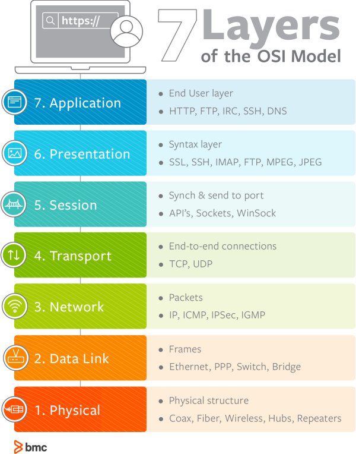
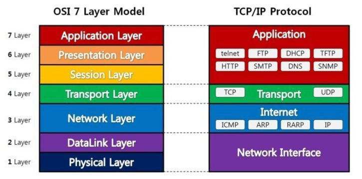

1. OSI 7 계층 단계
   - 1계층 - 물리계층(Physical Layer)
     - 데이터 전기적인 신호(0,1)로 변환해서 주고받는 기능만 함
     - 이 계층에서는 단지 데이터를 전달만 할뿐 전송하려는(또는 받으려는)데이터가 무엇인지, 어떤 에러가 있는지 등에는 전혀 신경 쓰지 않음 
     - 이 계층에 속하는 대표적인 장비는 통신 케이블, 리피터, 허브
       - => 0과 1의 나열을 아날로그 신호로 바꾸어 전선으로 흘려 보내고, 아날로그 신호가 들어오면 0과 1의 나열로 해석
       - => 물ㄹ리적으로 연결된 두 대의 컴퓨터가 0과 1의 나열을 주고받을 수 있게 해주는 모듈
     
   - 2계층 - 데이터 링크계층(DataLink Layer)
     - 물리계층을 통해 송수신되는 정보의 오류와 흐름을 관리하여 안전한 정보의 전달을 수행할 수 있도록 도와주는 역할 
     - 통신에서의 오류도 찾아주고 재전송도 하는 기능을 가지고 있는 것 
     - 맥 주소를 가지고 통신 
     - 이 계층에서 전송되는 단위를 프레임이라고 하고, 대표적인 장비로는 브리지, 스위치 
       - -> 브릿지나 스위치를 통해 맥주소를 가지고 물리계층에서 받은 정보를 전달함
         - => 같은 네트워크에 있는 여러 대의 컴퓨터들이 데이터를 주고받기 위해서 필요한 모듈

    - 3계층 - 네트워크 계층(Network Layer)
      - 데이터를 목적지까지 가장 안전하고 빠르게 전달하는 기능(라우팅)을 담당 
      - 여러 개의 노드를 거칠 때마다 경로를 찾아주는 역할을 하는 계층으로, 다양한 길 중 최적의 경로를 선택 
      - IP 주소를 사용하여 통신하며, 출발지와 목적지의 논리적 주소를 지정 
        - 경로(Route)에 따라 패킷을 전달 > IP 헤더 붙음
      - 이 계층에서 전송되는 단위를 패킷(Packet)
      - 대표적인 장비로는 라우터(Router), L3 스위치  
        - => ip 주소를 이용해서 길을 찾고, 자신 다음의 라우터에게 데이터를 넘겨주는 것
    
    - 4계층 - 전송 계층(Transport Layer)
      - 전송에 오류가 있으면 데이터를 재전송하는 기능을 수행 
      - 시퀀스 넘버 기반의 오류 제어 방식을 사용하며, 포트(Port) 번호로 프로세스를 구분 
      - 대표적인 프로토콜로 TCP(신뢰성 있는 연결형)와 UDP(비연결형)가 있음 
      - 전송 단위는 세그먼트(Segment)
      - 대표적인 장비로는 게이트웨이, L4 스위치
        - => Port 번호를 사용하여 도착지 컴퓨터의 최종 도착지인 프로세스에까지 데이터가 도달하게 하는 모듈

    - 5계층 - 세션 계층(Session Layer)
      - 데이터가 통신하기 위한 논리적인 연결(세션)을 담당 
      - 양 끝단의 응용 프로세스가 연결을 설정·유지·종료하도록 도와주는 역할 
      - TCP/IP 세션 체결, 포트번호를 기반으로 통신 세션 구성
    
    - 6계층 - 표현 계층(Presentation Layer)
      - 데이터의 표현 방식을 다루는 계층으로, 응용 계층으로부터 받은 데이터를 읽을 수 있는 형식으로 변환 
      - 코드 변환, 데이터 암호화 및 복호화, 압축, 인코딩/디코딩 등을 수행 
      - 사용자의 명령어를 완성하고 결과를 표현하며, 포장과 압축, 암호화 같은 역할을 담당 
        - MIME 인코딩, 데이터 압축(JPEG, MPEG 등), SSL/TLS 암호화 

    - 7계층 - 응용 계층(Application Layer)
      - 사용자와 가장 가까운 계층으로, 사용자가 네트워크에 접근할 수 있도록 응용 서비스를 제공 
      - 사용자 인터페이스, 전자우편, 데이터베이스 관리 등의 서비스를 제공 
      - 응용 프로세스와 직접 관계하여 일반적인 응용 서비스를 수행 
      - 대표적인 프로토콜로 HTTP, FTP, SMTP, POP3, Telnet, DNS 등이 있음
