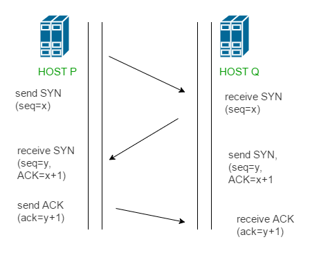

# TCP

### **TCP (전송 제어 프로토콜)**

- **Point-to-point 점대점 연결**
    - TCP connection 관점에서 봤을때 하나의 sender - 하나의 receiver 연결
    - 클라이언트 3개 접속 = TCP 소켓이 3개 생성됐다는 뜻
- **Reliable, in-order byte stream 신뢰성 O**
    - byte순서를 맞춰서 in-order delivery 보장
    - TCP는 전송한 순서 그대로 데이터를 전달
- **Full duplex data**
    - 송신(Send)과 수신(Receive)을 동시에 할 수 있는 통신 방식
    - Sender도 동시에 Receiver가 될 수 있고, Receiver도 동시에 Sender가 될 수 있음
    - 하나의 연결에서 양방향으로 동시에 데이터 전송 가능
- **MSS (Maximum Segment Size)**
    - 한번에 보낼 수 있는 segment 최대 사이즈
    - TCP/IP 헤더 크기를 제외한 순수 데이터(Payload)의 최대 크
- **Cumulative ACKs**
    - TCP에서 ACK (10) : 9번 까지 잘 받았음, 10번 요청
- **Connection-oriented :** 3 way handshaking

    
    
    - 데이터를 주고받기 전 양측은 handshake 진행
    - 서로 연결을 수립할 의사가 있음을 확인
        - 시작 시퀀스 번호(initial sequence number)를 알려줌 (자기가 랜덤하게 고른 처음 시작 값)
            - 처음 보내는 segment의 sequence number 은 몇번부터다
            - TCP는 전이중 연결이기 때문에 각자의 시퀀스 번호를 고르고 상대방에게 알려줘야함

### TCP 재전송 조건

1. **Timeout** — 재전송 타이머 만료
2. **Three Duplicate ACKs** — 똑같은 ACK이 3번 오면(dup ACK 3개) TCP는 timeout까지 기다리지 않고 즉시 재전송함
→ 이 즉시 재전송 동작 자체를 **Fast Retransmit**

**TCP Congestion Control Overview**

- **cwnd**
    - TCP는 한 번에 보낼 수 있는 데이터의 양을 cwnd로 제한
    - cwnd 크기는 네트워크 혼잡 상태에 따라 동적으로 조정
    - 전송 제한 조건: `LastByteSent - LastByteAcked ≤ cwnd`
        - 이미 보낸 데이터와 ACK 받은 데이터의 차이가 cwnd보다 크면 안 됨
    - 실제 송신 가능 윈도우는 `min(cwnd, rwnd)`
        - rwnd(receiver window)는 수신 측 버퍼 여유를 나타내는 flow control 값

### TCP 전송 속도 계산 공식

- TCP rate ≈ cwnd / RTT
- cwnd가 클수록, RTT가 작을수록 더 빠르게 전송 가능
- RTT가 크면 → 피드백 늦게 옴 → 전송속도 느려짐
- 네트워크에 여유가 있다면 → 전송 속도 증가
- 패킷 손실이 감지되면 → 전송 속도 감소
- → 이걸 반복해서 조절함으로써 혼잡을 피하면서 가능한 한 빠르게 데이터를 보냄

### TCP Congestion Control: 단계 & 손실 대응

- **Slow Start**
    - 처음 연결될 때 사용되는 단계 (혼잡을 모르니까 조심스럽게 시작)
    - cwnd를 매 RTT마다 **지수적으로(2배씩,** exponentially**)** 증가
    - 시작 조건
        - cwnd = 1 MSS
        - 매 RTT마다 받은 ACK 수만큼 cwnd += 1 MSS → 결과적으로 2배씩 증가
        - RTT마다 2배로 증가하는 효과
            - 1st RTT → 1 →2nd RTT → 2 →3rd RTT → 4 →4th RTT → 8 …
    - Timeout 발생 시 (혼잡 발생, 심각한 경우)
        - ssthresh = cwnd / 2
        - cwnd = 1 MSS
            - → Slow Start 다시 시작
    - 언제 Congestion Avoidance로 바뀌나?
        - cwnd가 ssthresh 도달 시
- **Congestion Avoidance**
    - 어느 정도 데이터가 보내졌고, 이제 **느리게(linearly)** 속도를 높임
    - 증가 속도: RTT마다 cwnd += 1 MSS
    - 시작 조건
        - cwnd가 ssthresh(slow start threshold)에 도달하면 진입
    - Congestion Avoidance의 작동 방식
        - RTT마다 cwnd를 1 MSS씩 증가
    - Timeout 발생 시
        - ssthresh = cwnd / 2
        - cwnd = 1 MSS
        - → 다시 Slow Start로 돌아감
- **Timeout**
    - 보낸 세그먼트에 대한 ACK 응답이 오지 않고 재전송 타이머가 만료됨
    - **ssthresh = cwnd / 2**
    - **cwnd = 1 MSS (완전 초기화)**
    - **→ Slow Start 단계로 다시 시작**
- **Fast Retransmit + Fast Recovery**
    - **Fast Retransmit**: 수신 측에서 같은 ACK을 3번 이상 연속으로 보냄 → 어떤 세그먼트는 손실됐지만 나머지는 도달 중이라는 뜻 → 타임아웃을 기다리지 않고 즉시 재전송
    - **Fast Recovery** (약한 congestion으로 판단, cwnd를 1로 완전히 리셋하지 않음)
        - ssthresh = cwnd / 2
        - cwnd = ssthresh(변경된 값) + 3
        - 이후 dup ACK가 추가로 더 오면 cwnd += 1 (임시 증가)
        - 이 상태에서 cwnd는 congestion avoidance처럼 완만하게 유지/증가

#### Fast Recovery 종료 조건

- **duplicate ACK이 아닌 새로운 ACK이 수신되면 탈출**
    - 탈출 시 cwnd = ssthresh (Fast Recovery 진입 시 계산했던 ssthresh 값으로 복구)
    - → 3-dup ACK 때 임시로 부풀렸던 +3만큼을 되돌리는 것
    - 탈출 후에는 **Congestion Avoidance 단계**로 진입

| 상태 | 동작 |
| --- | --- |
| ssthresh > cwnd | 지수적 증가 (Slow Start) |
| cwnd > ssthresh | 선형 증가 (Congestion Avoidance) |
| 3-dup ACK | ssthresh=cwnd/2, cwnd=ssthresh+3 → 새 ACK 오면 cwnd=ssthresh로 복귀 후 Congestion Avoidance |
| Timeout | ssthresh=cwnd/2, cwnd=1 → Slow Start |
