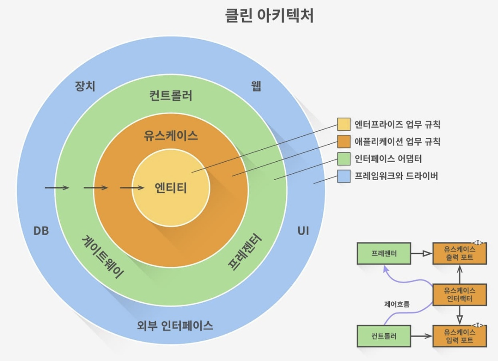

# 헥사고날 아키텍처
- 헥사고날 아키텍처(Hexagonal Architecture)는 소프트웨어 설계 패턴 중 하나
    - 포트와 어댑터 아키텍처라고도 불린다
    - 클린 아키텍처를 구현하는 가장 대표적인 모델
        - 클린 아키텍처란?

          
            
            - 외부 애플리케이션이나 인터페이스로부터 비즈니스 규칙이 독립적일 수 있다
            - 도메인 코드가 바깥으로 향하는 어떤 의존성도 없어야 한다는 것
            - 의존성 역전 원칙의 도움으로 계층 간의 모든 의존성이 코어 안쪽으로 향하게 해야 함
            - 비즈니스 규칙을 담는 도메인 코드, 즉, 엔티티는 어떤 영속성 프레임워크나 UI 프레임워크가 사용되는지 알 수 없기 때문에, 특정 프레임워크에 특화된 코드를 가질 수 없고 비즈니스 규칙에 집중
- 애플리케이션의 비즈니스 로직 (핵심 도메인 로직)을 외부 의존성으로부터 분리하여 애플리케이션의 유지보수성, 테스트 용이성, 유연성을 높이는 것
    
    !
    
    - 육각형 안에는 도메인 엔티티와 이와 상호작용하는 유스케이스가 위치
    - 육각형 바깥에는 애플리케이션과 상호작용하는 다양한 어댑터들이 위치
    - 애플리케이션 코어가 각각의 포트를 제공해야 하는데, 이는 애플리케이션 코어와 어댑터들 간의 통신을 위함
        - 입력과 출력을 가장자리에 배치
        - 비즈니스 로직은 REST 또는 GraphQL API를 노출시키는지 여부에 의존해서는 안됨
        - 데이터베이스나 API 또는 단순한 CSV 파일과 같은 데이터를 어디에서 가져오는지에 의존해서는 안 됨
            - 비즈니스 로직을 설계의 중심으로 하면서, 노출시키는 영역과 데이터를 가져오는 영역에 의존하지 않는 디자인
    - 의존성은 항상 외부 → 내부 방향
        - Controller는 UseCase를 앎
        - JPA Adapter는 Port를 앎
        - 도메인은 DB를 모름
        - 도메인은 Spring을 모름
        - 도메인은 JPA를 모름
        - 도메인은 외부 API를 모름
- **포트**
    - 애플리케이션 코어가 외부와 통신하기 위해 정의하는 인터페이스
    - Inbound Port (입력 포트)
        - 애플리케이션이 제공하는 기능
        - 보통 UseCase 인터페이스
    - Outbound Port (출력 포트)
        - 애플리케이션이 외부에 요구하는 기능
        - DB, 외부 API 등에 대한 추상화
- **어댑터**
    - 포트를 실제로 구현하는 객체
    - Input Adapter
        - Controller
        - Kafka Consumer
        - Scheduler
    - Output Adapter
        - JPA Repository
        - Redis
- 패키지 구조
    - 주로 `domain`, `application`(유스케이스와 포트), `adapter`(in/out) 형식으로 명확하게 분리
- 이점
    - **유연성**
        - 포트와 어댑터를 사용함으로써, 다양한 기술 변화에 대응할 준비
    - **유지보수성**
        - 책임이 분리되어 있어, 코드의 이해와 수정이 용이하며, 변화에 빠르게 대응
    - **테스트 용이성**
        - 각 컴포넌트를 독립적으로 테스트할 수 있을 뿐만 아니라, 외부 의존성 없이 테스트
- 단점
    - **복잡성 증가 및 보일러플레이트 코드**
        - 인터페이스(포트), 구현체(어댑터), DTO, 매퍼(Mapper) 등 작성해야 할 파일과 클래스 수가 많아집니다.
    - 단순한 CRUD 위주의 작은 프로젝트에서는 오히려 과도한 엔지니어링
