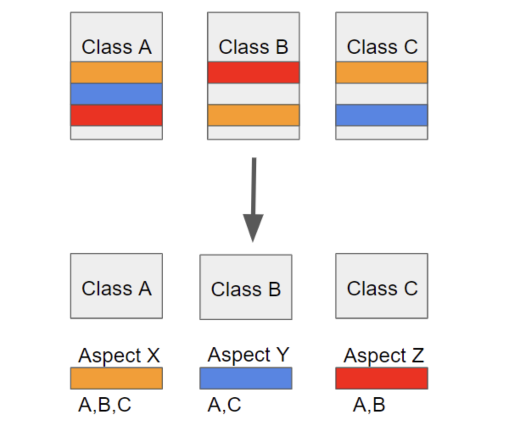

# Spring AOP 개념 및 동작 원리



#### 스프링 AOP ( Aspect Oriented Programming )

- AOP는 Aspect Oriented Programming의 약자로 관점 지향 프로그래밍
- 쉽게 말해 어떤 로직을 기준으로 핵심적인 관점, 부가적인 관점으로 나누어서 보고 그 관점을 기준으로 각각 모듈화하겠다는 것
    - 모듈화 : 어떤 공통된 로직이나 기능을 하나의 단위로 묶는 것
    - 핵심 단위가 관점이다
    - 핵심적인 관점 : 적용하고자 하는 핵심 비즈니스 로직
    - 부가적인 관점 : 핵심 로직을 실행하기 위해서 행해지는 데이터베이스 연결, 로깅, 파일 입출력
        - → 각 관점을 기준으로 로직을 모듈화한다는 것은 코드들을 부분적으로 나누어서 모듈화하겠다는 의미
- 소스 코드상에서 다른 부분에 계속 반복해서 쓰는 코드들 == 흩어진 관심사
    - 이 흩어진 관심사를 Aspect로 모듈화하고 핵심적인 비즈니스 로직에서 분리하여 재사용하겠다는 것이 AOP 의 취지
    - AOP의 대표적인 예시
        - 로깅과 트랜잭션, 보안 기능

#### 특징

- 프록시 패턴 기반의 AOP 구현체, 프록시 객체를 쓰는 이유는 접근 제어 및 부가기능을 추가하기 위해서임
- 스프링 빈에만 AOP를 적용 가능
- 수정이 편해진다.
- 반복되는 코드가 줄어든다.
- 재사용성이 높아진다.
- 비즈니스 로직에 집중할 수 있다.

#### **AOP 주요 개념**

- **Aspect** : 위에서 설명한 흩어진 관심사를 모듈화 한 것. 주로 부가기능을 모듈화함.
- **Target** : Aspect를 적용하는 곳 (클래스, 메서드 .. )
- **Advice** : aspect가 해야하는 작업과 시기.
- **JoinPoint** : Advice가 적용될 위치, 끼어들 수 있는 지점. 메서드 진입 지점, 생성자 호출 시점, 필드에서 값을 꺼내올 때 등 다양한 시점에 적용가능
- **PointCut** : JoinPoint의 상세한 스펙을 정의한 것. 실제 advice가 적용될 지점.
- **Proxy** : advice를 target 객체에 적용하면 생성되는 객체. Aspect를 구현하기 위해 프레임워크로부터 만들어진 객체
- **Cross-cutting concerns :** 로직 전 또는 후에 실행되어야하는 공통적인 작업.
- **Weaving** : Pointcut으로 결정한 타겟의 JoinPoint에 Advice를 적용하는 동작이나 과정 자체

### **@AspectJ 어노테이션 활용**

- 작성한 코드가 의도한 대로 잘 동작하는지 테스트 코드(JUnit 등)에서 결과를 확인할 때 사용

**1. @AspectJ 를 사용하기 위한 설정**

```sql
@EnableAspectJAutoProxy
```

**2. Aspect 구현하기**

- Advice

  | 어노테이션 | 실행 시점 |
  | --- | --- |
  | `@Before` | 비즈니스 로직 실행 전 |
  | `@AfterReturning` | 비즈니스 로직 실행 결과가 정상적으로 반환된 후 |
  | `@AfterThrowing` | 비즈니스 로직 실행 시 예외가 발생된 후 |
  | `@After` | 비즈니스 로직 실행 후 (예외 발생 여부와 상관없이 무조건 실행) |
  | `@Around` | 비즈니스 로직 실행 전과 후 (가장 강력함, 메서드 실행 자체를 제어 가능) |
- @Pointcut
    - 반복적으로 사용되는 pointcut을 지정
    - 해당 어노테이션을 활용하지 않고, advice 어노테이션 안에 pointcut을 지정해도 된다

### **Spring AOP API 활용**

- 핵심 비즈니스 로직(예: 회원 가입)과 부가적인 공통 로직(예: 실행 시간 로깅, DB 트랜잭션, 권한 체크)을 분리해서 코드를 깔끔하게 유지하기 위해 사용

1. **스프링 빈 대상이 되는 객체를 생성한다.(@Bean, 콤포넌트 스캔 대상)**
    - @Component, @Service, @Bean 등으로 선언된 클래스들의 객체(인스턴스)를 메모리에 new 키워드로 생성
        - @Service가 붙은 UserService라는 클래스가 있다고 가정
        - 스프링 컨테이너가 켜지면 제일 먼저 자바의 리플렉션을 이용해 new UserService()를 실행하여 메모리에 인스턴스를 올립니다.
            - 이때 만들어진 객체는 아직 스프링 컨테이너(빈 저장소)에 등록되지 않은 그냥 평범한 자바 객체
    
2. **생성된 객체를 빈 저장소에 등록하기 직전에 빈 후처리기에 전달한다.**
    - 스프링은 1번에서 만든 UserService 객체를 빈 저장소(Map)에 put 하기 전에, 무조건 BeanPostProcessor의 postProcessAfterInitialization 메서드를 거치게 만듭니다.
    
3. **모든 Advisor 빈을 조회하고 Pointcut을 통해 클래스와 메서드 정보를 매칭해보면서 프록시를 적용할 대상인지 판단한다.**
    - 후처리기는 스프링 컨테이너 안에 등록된 모든 Advisor(예: 트랜잭션 어드바이저)를 찾아옴
    - Advisor 안에는 Pointcut이 있음
    - 자바 리플렉션을 사용해 파라미터로 넘어온 UserService의 모든 메서드를 순회하며 @Transactional 같은 어노테이션이 붙어있는지 확인
    
4. **객체의 모든 메서드를 포인트컷에 비교해보면서 조건이 하나라도 만족한다면 프록시를 생성하고 프록시를 빈 저장소로 판단한다.**
    - 만약 UserService의 메서드 10개 중 딱 1개라도 @Transactional이 붙어있다면 매칭에 성공
    - 이때 ProxyFactory에 원본 UserService 객체를 밀어 넣고 .getProxy()를 호출해 원본을 상속받은(혹은 인터페이스를 구현한) 새로운 프록시를 메모리에 새로 만듬
        - 타겟 객체가 **인터페이스를 구현**하고 있을 때  → JDK 동적 프록시
        - 타겟 객체가 인터페이스 없이 **구체 클래스**만 있을 때 → CGLIB
    - 그리고 이 프록시 객체를 return
    
5. **만약 프록시 생성 대상이 아니라면 들어온 빈 그대로 빈 저장소로 반환한다.빈 저장소는 객체를 받아서 빈으로 등록합니다.**
    - 만약 UserService에 적용할 AOP 기능이 하나도 없다면 if문을 타지 않음
    - 메서드 맨 밑에 있는 return bean;이 실행되어 파라미터로 들어왔던 원본 객체를 그대로 return
    - ⇒ 스프링의 빈 저장소(내부적으로는 ConcurrentHashMap 같은 구조)는 이 후처리기가 최종적으로 return 해준 결과값을 받아서 스프링 빈으로 등록합니다. 프록시가 넘어오면 프록시를 등록하고, 원본이 넘어오면 원본을 등록

### **Aspect 구현**

- Advice를 정의

| **어드바이스 유형 (Advice Type)** | **스프링/AOP 인터페이스 (Interface)** | **개입 시점 및 특징** |
| --- | --- | --- |
| **Before** | `org.springframework.aop.MethodBeforeAdvice` | 타겟 메서드가 **실행되기 직전**에 호출됨. |
| **After-returning** | `org.springframework.aop.AfterReturningAdvice` | 타겟 메서드가 예외 없이 **정상적으로 결과를 반환한 후**에 호출됨. |
| **After-throwing** | `org.springframework.aop.ThrowsAdvice` | 타겟 메서드 실행 중 **예외가 발생하여 던져질 때** 호출됨. |
| **Around** | `org.aopalliance.intercept.MethodInterceptor` | 메서드 실행 **전/후, 예외 발생 시점 모두**에 개입할 수 있는 가장 강력한 어드바이스.  |
| **Introduction** | `org.springframework.aop.IntroductionInterceptor` | 기존 객체의 메서드를 가로채는 것이 아니라, 객체에 **새로운 인터페이스와 구현을 동적으로 추가**할 때 사용됨. |

### Pointcut

- 수많은 클래스와 메서드 중에서, Advice를 어느 메서드에 적용할지 필터링하는 조건
- 빈 후처리기가 객체의 메서드들을 순회할 때, 이 메서드는 프록시를 만들어야 해! 라고 판단하는 기준

```sql
@Pointcut("execution(* com.example.service..*(..))")
```

### Advisor

- **1개의 Pointcut + 1개의 Advice**를 묶어놓은 단일 객체
- 빈 후처리기는 프록시를 만들 때 Pointcut과 Advice를 따로 찾지 않고, 이 둘이 완벽하게 결합된 **Advisor 단위**로 조회하여 프록시 적용 여부를 판단

```sql
// [Advisor 생성]
// 스프링에게 "이 조건일 때, 이 기능을 실행해!" 라고 하나의 객체로 묶어서 알려줍니다.
    @Bean
    public DefaultPointcutAdvisor myAdvisor() {
        
        // 1. 어디에? (Pointcut 객체 준비)
        MyPointcut pointcut = new MyPointcut();
        
        // 2. 무엇을? (Advice 객체 준비 - 예: 로깅 기능, 트랜잭션 기능 등)
        MyAdvice advice = new MyAdvice();
        
        // 3. Advisor = Pointcut + Advice (두 개를 결합!)
        return new DefaultPointcutAdvisor(pointcut, advice);
    }
```

### Aspect

- 여러 개의 Pointcut과 Advice를 하나로 모아둔 논리적인 그룹이자 캡슐화된 모듈(클래스)
- 로깅, 보안, 트랜잭션 같은 공통 관심사를 하나의 공간에 모아둠

```sql
// [Aspect 선언]
// 클래스 위에 @Aspect를 붙이는 순간, 이 클래스 전체가 하나의 모듈
// 이 공간 안에 여러 개의 부가 기능과 적용 조건들을 싹 다 모아둡니다.
@Aspect
@Component
public class SecurityAspect {

    // @Before("조건") 형태로 
    // Pointcut("save로 시작하는 메서드")과 Advice(권한 검사 로직)를 한 방에 묶어서 정의합니다.
    @Before("execution(* save*(..))")
    public void checkSecurity() {
        System.out.println("보안 권한 검사 중...");
    }
}
```

### **AssertJ**와 **Spring AOP**

| **구분** | **AssertJ** | **Spring AOP** |
| --- | --- | --- |
| **핵심 역할** | 테스트 결과 검증 | 흩어진 공통 기능 모듈화 |
| **작동 시점** | 개발자가 테스트 코드를 실행할 때 | 실제 애플리케이션 서버가 돌아갈 때 (런타임) |
| **주요 키워드** | `assertThat()`, 테스트 가독성 향상 | 프록시, 가로채기, Pointcut, Advice |
| **대표 쓰임새** | 단위 테스트, 통합 테스트 작성 | `@Transactional`, 실행 시간 측정 로깅, 보안 검사 |
